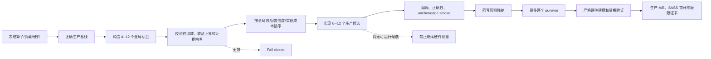

# 机会驱动算子搜索：架构改造与验证报告

## 1. 结论摘要

本次改造在原有“多候选发现 + 严格资格验证”之间增加了一层可执行的
**全局机会编译器（opportunity compiler）**。它要求 Agent 在写候选、跑
profile 或设计微基准之前，先把当前模型中可能带来收益的改写方向量化为
机会，按预期全局收益、置信度和实现成本排序，再让候选实现绑定这些机会。

这项改造解决的不是“某一个 CUDA kernel 怎样写得更快”，而是 Agent 的
搜索控制问题：怎样避免在低价值局部点上反复迭代，怎样更早产出真实代码，
怎样让数学估计参与架构选择，以及怎样用实测结果校准后续判断。

实现已经在 Windows、WSL 和 RTX 5090（compute capability 12.0）上通过
完整测试。5090 上已有验证 run 在加载新架构后，下一动作从继续实验变成了
`BUILD_OPPORTUNITY_MAP`，说明 implementation-first 门禁实际生效。

需要明确：这证明搜索架构可运行、约束能生效，不等价于已经证明某个算子
达到理论最优或超过 SOTA。理论极限证明和外部水平比较仍是独立问题。

## 2. 原架构的问题

原发现循环已经具备以下正确方向：一次生成 6--12 个候选、覆盖至少四个
架构族、技术错误允许修复、只把少量 survivor 送入严格资格验证，并设置
候选与总墙钟预算。

但候选之前缺少一个机器可读的“为什么值得实现”层：

1. `family` 和 `hypothesis` 主要是自由文本，无法确认候选对应全局模型里的
   哪个成本项。
2. 多候选只保证表面多样性，不能阻止六个候选都围绕同一个低收益机会。
3. 数学模型里的耗时、必要工作和可消除工作没有转化成实现优先级。
4. `UNKNOWN` 容易被误解为“应该继续测”，即使还没有可运行的生产候选。
5. 预测与实测之间没有残差回写，Agent 即使持续高估某类优化，也不会得到
   结构化反馈。
6. 分解方式相关的“最小工作量”可能被误称为全局理论下界。例如当前分阶段
   实现所需的中间写回，在合法融合后可能完全消失。

结果是：Agent 虽然在工作，却可能把绝大多数预算花在不影响最终目标排序的
问题上。这正对应“没有大局观、迭代慢、两周后仍只是一般水平”。

## 3. 改造后的架构



架构顺序由原来的：

`baseline → candidate portfolio → measurement/model closure`

变为：

`baseline → quantified opportunity portfolio → ranked implementation portfolio
→ cheap screening → finalist-only measurement/model closure`

核心变化是把“思考优化方向”从隐含在 Agent 上下文中的自然语言过程，变成
可以校验、排序、追踪和复算的运行时对象。

## 4. 具体代码修改

### 4.1 新增机会地图数据契约

新增文件：

- `schemas/opportunity_map.schema.json`
- `templates/optimization_run/opportunity_map.json`
- `scripts/opportunity_map.py`

每个机会必须提供：

- `opportunity_id`：稳定身份；
- `model_scope`：只能是分解条件、当前调度或经验瓶颈；
- `source_model_term` 和 `affected_stages`：机会来自哪里；
- `current_contribution_us`：该项当前对全局目标的贡献；
- `optimistic_gain_ceiling_us`：乐观情况下最多能消除多少；
- `likely_gain_interval_us`：更现实的收益区间；
- `confidence`：估计置信度；
- `rewrite_families`：允许探索的架构族；
- `implementation_budget_minutes`：实现预算；
- `derivation`：数值推导说明；
- `evidence`：run 内模型文件路径、SHA-256 和该文件支撑的 claim。

工具强制以下数值不变量：

```text
0 <= likely_lower
  <= likely_upper
  <= optimistic_gain_ceiling
  <= current_global_contribution
```

机会排序分数为：

```text
priority_score = midpoint(likely_gain_interval_us)
                 * confidence_weight
                 / implementation_budget_minutes
```

它不是唯一正确的决策函数，但比“哪里不确定就测哪里”更符合优化目标：优先
购买单位实现时间下更可能带来全局收益的尝试。

`READY` 不是一个可手填的标签。调度器会重新校验：

- 机会数与 rewrite-family 多样性；
- 每个数值区间；
- 证据文件是否仍存在且 SHA-256 未变化；
- 排名顺序和分数是否可复算；
- ID、生命周期状态和候选绑定是否一致。

任何手改排名、过期模型证据或越界收益都会进入
`BLOCK_INVALID_OPPORTUNITY_MAP`。

### 4.2 候选必须绑定全局机会

修改 `scripts/candidate_discovery.py`：

- 候选新增 `opportunity_id`；
- 候选新增 `predicted_global_gain_us`；
- 机会地图必须已经 `READY`；
- 候选 family 必须属于该机会声明的 rewrite families；
- 候选预测上界不得超过机会的乐观收益上界；
- 默认候选组合至少覆盖三个不同机会；
- promotion artifact 保留机会身份、预测和实测残差。

这把“六个看起来不同的 block-size 变体”与“跨三个全局机会的六个结构候选”
区分开来。前者不能再仅凭数量满足多样性门禁。

### 4.3 形成预测—观测反馈

候选通过 smoke 后，系统计算：

```text
predicted_midpoint_us = (predicted_lower + predicted_upper) / 2
observed_global_gain_us = baseline_us - candidate_us
residual_us = observed_global_gain_us - predicted_midpoint_us
```

结果同时写入 candidate pool 和 opportunity map，作用域明确标记为
`DISCOVERY_ONLY`。这不能替代生产资格验证，但使 Agent 能识别自己长期高估或
低估的优化族，而不是每轮都从同样的主观判断重新开始。

### 4.4 改成 implementation-first 调度

修改 `scripts/optimizer_step.py`，新增以下确定性动作：

- `BUILD_OPPORTUNITY_MAP`：基线有效但机会地图不存在；
- `EXPAND_OPPORTUNITY_MAP`：机会数量或 rewrite-family 多样性不足；
- `RANK_OPPORTUNITIES`：机会齐全但尚未复算排名；
- `EXPAND_DISCOVERY_PORTFOLIO`：直接返回最高排名且尚未覆盖的机会；
- `IMPLEMENT_DISCOVERY_CANDIDATE`：候选已提出，下一步必须产出/运行代码；
- `REPAIR_DISCOVERY_CANDIDATE`：技术错误在预算内修复；
- `OPPORTUNITY_PORTFOLIO_CLOSED`：所有机会都有哈希绑定的关闭证书；在明确的
  重开条件发生前，不允许重新扫同一条死路；
- `BLOCK_MEASUREMENT_WITHOUT_WORKING_CANDIDATE`：没有通过 smoke 的机会绑定候选
  时，禁止掉入硬件测量和微基准路径。

因此，只有“已经有真实候选，而且某个未知量会影响候选排序”时，严格实验才
可能成为合理的下一步。

### 4.5 运行生命周期和公共 CLI

修改 `scripts/new_run.py`，每个新 run 自动创建 DRAFT opportunity map；修改
`scripts/kernel_opt.py`，增加稳定命令：

```bash
python3 scripts/kernel_opt.py opportunity init --run runs/<run-id> --if-missing
python3 scripts/kernel_opt.py opportunity add --run runs/<run-id> --spec <spec.json>
python3 scripts/kernel_opt.py opportunity rank --run runs/<run-id>
python3 scripts/kernel_opt.py opportunity close --run runs/<run-id> \
  --opportunity-id <id> --disposition <reason-class> \
  --reason <global-stop-reason> --evidence <result.json> \
  --evidence-claim <claim> --reopen-condition <condition>
python3 scripts/kernel_opt.py opportunity reopen --run runs/<run-id> \
  --opportunity-id <id> --reason <changed-condition>
python3 scripts/kernel_opt.py opportunity status --run runs/<run-id>
```

`CLOSED` 不是一句自由文本观察。关闭证书必须记录 disposition、全局止损理由、
run 内证据的 SHA-256，以及至少一个可判定的重开条件。调度器和候选注册器都会
排除已关闭机会；证据被改写时机会地图失效。只有显式 `reopen` 才能恢复预算，
并把原因写入事件和观察历史。

### 4.6 Agent 行为规则和文档

修改：

- `AGENTS.md`
- `README.md`
- `REVIEW.md`
- `skill/kernel-optimizer/SKILL.md`
- `skill/kernel-optimizer/references/discovery_loop.md`

新规则要求 Agent：先建立全局机会组合，再建立实现组合；在没有工作候选时
不得把“收集更多数据”当作默认动作；分解条件下界不得称作绝对理论最优。

### 4.7 自动化测试

新增 `tests/test_opportunity_driven_search.py`，并扩展 candidate discovery 与
repository tests。覆盖：

- 高全局收益、低实现成本的机会排名更高；
- 绝对全局最优伪声明被拒绝；
- 不存在的机会不能绑定候选；
- 手改分数后 `READY` 地图被阻断；
- 调度器先要求机会地图，再要求候选实现；
- smoke 后预测残差正确回写；
- 新 run 自动带有 opportunity map。

本次提交共修改 15 个文件，新增 816 行、删除 39 行。

## 5. 为什么这个方案可行

### 5.1 它优化的是全局目标，不是局部指标

机会的收益上界被限制在它对全局目标的当前贡献之内。即使某个局部优化能把
一个 stage 提速很多，只要该 stage 在端到端目标中占比很小，它的机会分数
仍然不会压过融合、消除物化或改变分解等更大方向。

### 5.2 它允许大胆架构变化，但给失败设置边界

Agent 不再通过“小改一点以避免犯错”来控制风险。风险由多个架构族、每个
候选的实现时间、技术修复次数、总墙钟预算和 cheap smoke 共同控制。这允许
提出 fusion、persistent scheduling、ownership 重构和数据流重写，同时避免
任一方向无限消耗预算。

### 5.3 它不依赖查看外部算子源码

机会可完全从当前 run 的算子语义、基线、work ledger 和 DAG 产生，证据也只
绑定 run-local artifact。因此它符合“测试 Agent 基于现有资源能否自行发现
好方案”的目标。

外部实现仍可作为独立、隐藏的评估器：生成 Agent 看不到源码和中间排名，
只在固定 checkpoint 比较最终差距。这样能保留自主搜索实验的纯度，又避免
在没有参照物时把普通水平误认为 SOTA。

### 5.4 它建立了可学习的闭环

机会估计不再只存在于一段 prompt 里。预测、证据、候选和观测残差都有稳定
身份，后续可以统计某类 rewrite family 的成功率、收益偏差和单位时间价值。
这是进一步训练策略模型或做 bandit/Bayesian 调度的必要数据基础。

### 5.5 它和原严格证明链兼容

机会地图只决定“先实现什么”，不降低原来的生产正确性、正式 A/B、最终二进
制 SASS/resource audit、硬件证据和 limit certificate 门槛。搜索速度和证明
可信度被放在两条不同成本的通道里，避免为了严格而迟迟不写代码，也避免用
廉价 smoke 冒充最终结论。

## 6. 解决问题的对应关系

| 原问题 | 根因 | 本次机制 | 预期变化 |
|---|---|---|---|
| 卡在不重要的局部点 | 没有全局收益上限和统一排序 | opportunity map + 全局贡献约束 | 低上限方向自动降级 |
| 迭代很慢 | 先补模型/测量，迟迟没有代码 | implementation-first gate | 基线后先形成真实候选 |
| 不敢大改 | 风险靠“小步修改”控制 | 多机会、多架构族、独立预算 | 可以并行尝试结构重写 |
| 一条路失败就卡住 | 技术失败与因果失败混淆 | bounded repair lifecycle | 编译/布局错误可修复，不误杀假设 |
| 多候选仍缺乏大局观 | 只检查 family 数量 | 至少覆盖三个量化机会 | 候选组合覆盖不同全局收益源 |
| 重复高估某类优化 | 没有预测残差 | prediction check 回写 | 后续可以校准估计偏差 |
| 长时间只实验不生产 | 未知量天然触发测量 | 无 working candidate 禁止测量 | 测量服务于候选排序 |
| “数学最优”说法过强 | 混淆分解下界和语义下界 | scope enum + 禁止绝对声明 | 理论结论边界更准确 |

## 7. 已完成验证

提交：`c8c0c7c Add opportunity-driven kernel search`

分支：`feature/opportunity-driven-search`

验证矩阵：

| 环境 | 结果 |
|---|---|
| Windows 干净提交快照 | 全套测试通过 |
| WSL 干净提交快照 | 全套测试通过 |
| NVIDIA GeForce RTX 5090 / compute capability 12.0 | 全套测试通过 |
| 5090 现有验证 run | 下一步正确返回 `BUILD_OPPORTUNITY_MAP` |
| Repository purity audit | PASS |

5090 验证证明新分支能在目标 CUDA 主机上运行，并且调度门禁改变了实际 run
的行为。它没有声称此提交本身带来了某个生产算子的性能提升；性能结论必须由
朋友在真实目标算子上运行新的机会—候选闭环后给出。

## 8. 尚未解决和不能过度承诺的部分

1. **还不是全自动数学推导器。** Agent 仍需从 work ledger、DAG 和 baseline
   生成 opportunity spec；工具负责约束、证据绑定和排序，而不是自动理解任意
   算子公式。
2. **排序函数是工程启发式。** midpoint × confidence / cost 合理且可复算，
   但不是全局最优搜索的数学证明。
3. **还没有跨 run 的策略学习。** 残差已被记录，但尚未自动聚合成 rewrite
   family 的先验分布。
4. **还没有独立 SOTA evaluator。** 没有同 ABI、同 workload、同硬件和同
   测量协议的外部基准，不能回答“距离 SOTA 还有百分之多少”。
5. **候选代码仍由 Agent 生成。** 新架构能迫使它更早、更有方向地写代码，
   但代码生成模型本身的 CUDA/Triton 能力仍决定候选质量上限。
6. **理论最优仍需原证书链。** 只有语义必要工作、硬件资源服务下界、依赖
   DAG 下界、可行调度上界和生产置信区间共同闭合，才能谈理论 gap。

因此，本次改造的准确结论是：**它能显著提高自主搜索找到高价值候选的概率，
并减少无效实验；不能单独保证达到理论最优或超过所有公开实现。**

## 9. 建议朋友怎样试

建议用同一个真实算子做旧分支与新分支的等预算 A/B，而不是只观察最终最快
数字。固定模型、提示词、硬件、正确性契约和两小时总预算，记录：

1. 从 baseline 到第一个可编译候选的时间；
2. 两小时内产生的独立机会数、架构族数和有效候选数；
3. 写出候选代码之前花在 profile/微基准上的时间；
4. 最佳候选相对 baseline 的完整 workload 改进；
5. 预测收益区间命中率与残差；
6. 最终候选相对隐藏外部 best-known 实现的差距；
7. 每个失败方向消耗的墙钟和技术修复次数。

新架构应至少满足以下行为标准：

- 正确 baseline 后不继续无目标测量；
- 机会组合未完成前不注册候选；
- 候选组合未覆盖三个机会前不 promotion；
- 没有 working candidate 时不进入硬件实验；
- 每次 smoke 后都有 prediction residual；
- promotion 后才为 top candidates 支付严格建模和测量成本。

如果这些行为成立但最终性能仍差很多，问题就不再主要是“大局观和调度”，而
更可能落在候选代码生成能力、算子语义建模质量、rewrite family 覆盖不足或
缺少强外部评估信号上。届时下一阶段应针对这些环节继续改，而不是增加更多
无差别 profile。

## 10. 交付状态

- 本地分支：`feature/opportunity-driven-search`
- 实现提交：`c8c0c7c`
- 可移交 bundle：`D:\codes\kernel_opt_agent-opportunity-driven-search.bundle`

bundle 会在报告提交后重新生成；交付时应使用 `Get-FileHash` 或 `sha256sum`
校验最终文件，而不是复用旧 bundle 的摘要。

GitHub origin 当前拒绝本机账号写入朋友的仓库，因此远端分支尚未创建。获得
仓库写权限后可直接执行：

```bash
git push -u origin feature/opportunity-driven-search
```
